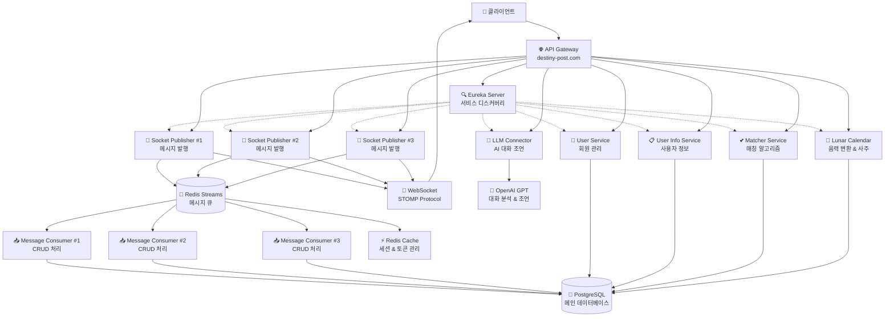

<p align="center">
  
</p>

<h3 align="center">🔮 국내 유일! 명리학 기반 사주 랜덤 채팅 서비스! 🔮</h3>

<p align="center">
  사주팔자를 기반으로 운명적인 만남을 주선하는<br>
  새로운 개념의 매칭 & 채팅 플랫폼!<br>
  당신의 사주를 분석해 최고의 상대를 찾아드리고, 대화에 도움이 되는 맞춤 조언까지!<br><br>
  ✨ <strong><a href="https://destiny-post.com" target="_blank">지금 바로, 운명적인 만남을 시작해보세요</a></strong>
</p>

<br><br><br>

## 🌟 프로젝트 소개
**운명 사서함**은 전통 명리학과 현대 기술을 결합한 혁신적인 랜덤 채팅 서비스입니다.

사주팔자 분석을 통해 상대와의 궁합과 그에 따른 점수를 노출해 선택의 도움을 주고,  
대화 중에도 상대방의 성향과 특성을 고려한 맞춤형 대화 가이드를 제공하기 위해 개발하였습니다.

현대인들의 진정한 만남에 대한 갈증을 해소하고,  
의미 있는 인연을 만들어가는 **새로운 소셜 플랫폼**입니다.

- 명리학 기반 과학적 매칭 시스템
- AI가 제공하는 실시간 대화 조언  
- 깊이 있는 인간관계 형성 지원
- 안전하고 건전한 채팅 환경

진정한 운명적 만남을 경험해보세요.
<br><br><br>

## 📷 DEMO
| 메인 화면 | 채팅 화면 |
|:--:|:--:|
|  |  |

<br><br><br>

## 📌 서비스 개요

| 항목 | 내용 |
|------|------|
| 서비스명 | **운명 사서함** |
| 주요 컨셉 | 명리학 기반 사주 분석을 통한 운명적 랜덤 채팅 매칭 서비스 |
| 핵심 기능 | 사주 기반 매칭, AI 대화 조언, 궁합 분석, 실시간 채팅 |
| 주요 타겟 | 20~40대 진정한 만남을 원하는 사용자층 (특히 전통문화와 신비주의에 관심 있는 사용자) |
| 제공 가치 | 단순한 외모나 조건이 아닌, 본질적 궁합을 바탕으로 한 의미 있는 만남 창출 |
| 수익 모델 | 기본 매칭 무료 → 프리미엄 기능(상세 사주 분석, 무제한 매칭 등) 유료 제공 |
| 서비스 특징 | 전통 명리학 + 현대 AI 기술 융합, STOMP 기반 실시간 통신, 마이크로서비스 아키텍처 |
| 매칭 철학 | 겉모습보다 내면의 조화를 중시하는 **"운명적 인연"** 중심의 만남 주선 |

<br><br><br>

## ✨ 핵심 기능

### 🎯 **사주 기반 스마트 매칭**
- 생년월일시를 기반으로 한 정밀한 사주팔자 분석
- 오행 상생상극 원리를 적용한 궁합 점수 산출
- 성격, 가치관, 생활패턴까지 고려한 매칭 알고리즘
- 단순 랜덤이 아닌 **운명적 확률** 기반 상대 추천

### 💬 **AI 대화 조언 시스템**
- 상대방의 사주 특성을 분석한 맞춤형 대화 가이드 제공
- 실시간 대화 분위기 파악 및 적절한 화제 추천
- 상대방이 좋아할 만한 관심사와 성향 정보 제공
- 어색한 순간을 자연스럽게 넘어갈 수 있는 대화 팁

### 📊 **상세 궁합 분석**
- 서로의 장단점과 보완점 상세 분석
- 관계 발전 단계별 조언 및 주의사항 제공
- 장기적 관계 전망과 조화로운 만남 방향 제시

### 🔒 **안전한 채팅 환경**
- JWT 기반 보안 인증 시스템
- Redis를 활용한 실시간 세션 관리
- 부적절한 내용 필터링 및 신고 시스템
- 개인정보 보호를 위한 단계적 정보 공개

<br><br><br>

## 🛠️ 기술 스택

### 💻 **Backend**
[](https://spring.io/projects/spring-boot)
[](https://www.oracle.com/java/)
[](https://www.oracle.com/java/technologies/persistence-jsp.html)
[](http://querydsl.com/)
[](https://spring.io/projects/spring-cloud)
[](https://stomp.github.io/)

### 🗄️ **Database & Cache**
[](https://www.postgresql.org/)
[](https://redis.io/)

### 🔧 **Infrastructure**
[](https://www.docker.com/)
[](https://docs.docker.com/compose/)
[](https://www.jenkins.io/)
[](https://www.linux.org/)

### 🤖 **AI & External APIs**
[](https://openai.com/)

<br><br><br>

## 🏗️ 시스템 아키텍처

### 🔄 **마이크로서비스 아키텍처**



**🏗️ 메시지 처리 플로우**
```
┌─────────────────────────────────────────────────────────┐
│              🔍 Eureka Discovery Server                  │
│                서비스 등록 & 발견                         │
└─────────────────┬───────────────────────────────────────┘
                  │
    ┌─────────────┼─────────────┬─────────────┬─────────────┐
    │             │             │             │             │
┌───▼───┐    ┌───▼───┐    ┌───▼───┐    ┌───▼───┐    ┌───▼───┐
│ 👥    │    │ 📋    │    │ 💕    │    │ 🌙    │    │ 🤖    │
│ User  │    │ User  │    │Matcher│    │Lunar  │    │ LLM   │
│Service│    │ Info  │    │Service│    │Calendar│    │Connector│
└───────┘    └───────┘    └───────┘    └───────┘    └───────┘
                                │
                                ▼
                     ┌─────────────────┐
                     │   📡 Socket     │
                     │   Publisher     │
                     │   (메시지 발행)   │
                     └─────────┬───────┘
                               │
                               ▼
                     ┌─────────────────┐
                     │  🔴 Redis       │
                     │  Streams        │
                     │  (메시지 큐)     │
                     └─────────┬───────┘
                               │
                    ┌──────────┼──────────┐
                    │          │          │
                    ▼          ▼          ▼
            ┌──────────┐ ┌──────────┐ ┌──────────┐
            │ 📥 Msg   │ │ 📥 Msg   │ │ 📥 Msg   │
            │Consumer#1│ │Consumer#2│ │Consumer#3│
            │(병렬처리) │ │(병렬처리) │ │(병렬처리) │
            └─────┬────┘ └─────┬────┘ └─────┬────┘
                  │            │            │
                  └────────────┼────────────┘
                               │
                               ▼
                    ┌─────────────────┐
                    │ 🐘 PostgreSQL   │
                    │   CRUD 처리     │
                    └─────────────────┘
```

**💡 핵심 메시지 처리 흐름:**
1. **Socket Publisher** → 실시간 메시지 발행
2. **Redis Streams** → 메시지 큐잉 및 분산
3. **Message Consumer (병렬)** → 비동기 CRUD 처리
4. **PostgreSQL** → 최종 데이터 저장

### ⚡ **실시간 통신 & 메시지 처리**
- **STOMP over WebSocket**: 실시간 채팅 및 매칭 알림
- **Redis Streams 기반 메시지 아키텍처**: 
  - **Socket Publisher**: WebSocket 연결 관리 및 실시간 메시지 발송
  - **Message Consumer**: Redis Stream에서 메시지 소비 및 배치 처리
  - **채팅 서비스와 병렬 구조**: 높은 처리량과 장애 격리를 위한 독립적 서비스 운영
- **Redis Pub/Sub**: 채팅방 알림 및 상태 변경 실시간 브로드캐스트
- **LLM Connector**: AI 대화 조언을 위한 독립적 LLM 통신 서비스

### 🔐 **보안 & 인증**
- **JWT 기반 토큰 인증**: Access Token + Refresh Token 방식
- **Redis 기반 세션 관리**: 토큰 블랙리스트 및 중복 로그인 방지
- **Spring Security**: 엔드포인트별 접근 권한 제어

### 📊 **데이터 처리**
- **JPA + QueryDSL**: 복잡한 사주 분석 쿼리 최적화  
- **Redis Caching**: 자주 조회되는 궁합 데이터 캐싱
- **배치 처리**: 매칭 점수 갱신 및 통계 데이터 생성

<br><br><br>

## 📈 개발 로드맵

### 🚀 **v1.0 (현재)** - 기본 매칭 & 채팅
- ✅ 사주 기반 매칭 시스템
- ✅ 실시간 1:1 채팅
- ✅ 기본 궁합 분석
- ✅ JWT 인증 시스템

### 💫 **v1.1 (2차)** - 채팅 고도화
- 🔄 **채팅 미션 기능**: 대화를 더 재미있게 만드는 미션 시스템
- 🔄 **궁합 및 사주 공유 기능**: 친구들과 궁합 결과 공유
- 🔄 **메인 커플 랭킹 시스템**: 가장 궁합이 좋은 커플 순위
- 🔄 **채팅 플로팅 버튼**: 읽음 표시, 집계 및 채팅방 바로가기

### 🎨 **v1.2 (3차)** - 아바타 시스템  
- 🔄 **AI 아바타 생성**: 사진 + 사주 요소 기반 개성 있는 프로필 생성
- 🔄 **아바타 커스터마이징**: 사주 특성이 반영된 AI 아바타 생성
- 🔄 **아바타 매칭**: 시각적 매력도를 고려한 매칭 옵션

### 🌐 **v1.3 (4차)** - 커뮤니티 기능
- 🔄 **사주 커뮤니티**: 사주 분석 결과 공유 및 토론
- 🔄 **소셜 기능**: 친구 추가, 그룹 채팅, 관심사 기반 모임
- 🔄 **콘텐츠 공유**: 궁합 결과, 운세 등 SNS 공유 기능

### 💎 **v1.4 (5차)** - 프리미엄 서비스
- 🔄 **인앱 결제 시스템**: 안전하고 편리한 결제 환경
- 🔄 **프리미엄 기능**: 
  - 무제한 매칭
  - 상세 사주 분석 리포트  
  - 전문가 사주 상담 서비스

### 🔧 **모니터링 & 알림**
- Docker 컨테이너 기반 서비스 상태 모니터링
- Redis 연결 상태 및 메모리 사용량 추적
- 실시간 에러 로그 및 알림 시스템

### 🌐 **접속 정보**
- **메인 서비스**: https://destiny-post.com
<br><br><br>

## 👥 개발팀

| 구성원 | GitHub | 역할 |
|--------|--------|------|
| 주재범 | [@jaebum7396](https://github.com/jaebum7396) | 백엔드 아키텍처, 인프라, 사주 분석 시스템 |
| 팀원2 | [@teammate2](https://github.com/teammate2) | 프론트엔드, UI/UX, 채팅 인터페이스 |

<br><br><br>

## 📞 Contact & Support

- 📧 **Email**: petfortune8996@gmail.com
- 🌐 **Website**: https://destiny-post.com  

---

<p align="center">
  <i>🔮 운명적인 만남, 지금 시작하세요! 🔮</i>
</p>
